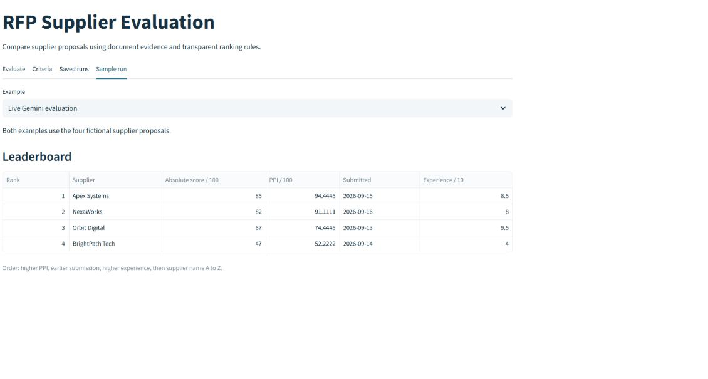
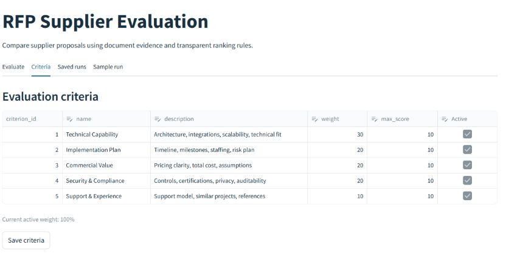
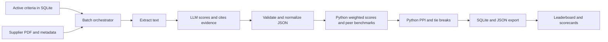

# RFP Supplier Evaluation

A Streamlit application that reads supplier proposal PDFs, asks Gemini or Ollama Cloud for evidence-based criterion scores, validates the response, and ranks suppliers with fixed Python rules. The repository includes four fictional two-page proposals, a completed Gemini run, a validation example, and automated checks.

## Run locally

```powershell
python -m venv .venv
.\.venv\Scripts\Activate.ps1
pip install -r requirements.txt
python scripts/seed_db.py
streamlit run streamlit_app.py
```

Open the local URL printed by Streamlit. In **Evaluate**, upload at least two text-based proposal PDFs, enter a unique supplier name, submission date, and experience rating from 0 to 10 for each, then enter your Gemini or Ollama Cloud API key in **AI connection**. Select a model and click **Evaluate suppliers**. The key is used for the request and is not saved in SQLite or JSON.

The **Sample run** tab works without an API key. It contains a live Gemini evaluation of all four included proposals and a separate example that demonstrates score normalization. **Saved runs** shows completed local evaluations.

## Application screenshots

The screenshots below show the completed Gemini run and the editable criteria loaded from SQLite.





## Included files

| Path | Purpose |
| --- | --- |
| `streamlit_app.py` | Upload, criteria editor, leaderboard, scorecards, saved runs, JSON download |
| `rfp/database.py` | SQLite schema, criteria seed, criteria editing, run persistence |
| `rfp/evaluation.py` | PDF extraction, dynamic prompt, Gemini and Ollama calls, JSON normalization |
| `rfp/scoring.py` | Weighted score, benchmark, gaps, PPI, fixed ranking |
| `rfp/workflow.py` | Batch orchestration and atomic persistence |
| `data/proposals/*.pdf` | Four fictional two-page supplier proposals |
| `data/live_run.json` | Completed evaluation from Gemini 2.5 Flash |
| `data/sample_run.json` | Reproducible example with an invalid score corrected to zero |
| `scripts/generate_demo.py` | Regenerate proposals and the validation example |
| `scripts/run_live_demo.py` | Run all four proposals through Gemini using an environment key |
| `tests/test_core.py` | Validation, formulas, tie breaks, zero benchmark, persistence |
| `docs/Agentic_RFP_Evaluation_Submission.docx` | Formatted submission report |
| `docs/Agentic_RFP_Evaluation_Submission.pdf` | PDF copy of the submission report |

## Evaluation flow



The prompt is built from the active rows in SQLite. It asks for one score per active criterion, a short document quotation, a justification, risks, and a summary. The model does not calculate benchmarks or ranks. Missing or malformed scores become zero; scores outside the range are clipped; duplicate and unknown criteria are ignored. Every correction is recorded as a run warning. Active weights must total 100% before a batch begins.

## Scoring rules

| Measure | Rule |
| --- | --- |
| Absolute score | Sum of `(score / maximum score) × criterion weight` |
| Benchmark | Highest valid supplier score for the criterion in the batch |
| Gap | Supplier score minus benchmark |
| Relative performance | `(supplier score / benchmark) × 100`; if all scores are zero, use 100% |
| PPI | Sum of `relative performance × criterion weight / 100` |
| Rank | Higher PPI, earlier submission date, higher experience rating, then supplier name A to Z |

The zero benchmark rule treats suppliers as tied on a criterion with no positive evidence. Rank numbers start at 1 after sorting.

## Fictional proposal set

| Supplier | Distinguishing content |
| --- | --- |
| Apex Systems | Strong architecture and security, higher price, 15-week delivery |
| BrightPath Tech | Lowest price and eight-week timeline, limited compliance detail |
| NexaWorks | Strong milestone plan and support, balanced cost |
| Orbit Digital | Extensive references, unclear ERP integration scope |

Each PDF contains the same procurement request plus a solution, timeline and team, price and assumptions, security and risk controls, support, experience, and references. All names and projects in the proposals are fictional.

## Completed demonstration

The Gemini run is in `data/live_run.json`. It ranked Apex Systems first at PPI 94.4445, NexaWorks second at 91.1111, Orbit Digital third at 74.4445, and BrightPath Tech fourth at 52.2222. BrightPath's model response had a malformed `risks` field; the validator replaced it with an empty list and recorded a warning. The separate validation example in `data/sample_run.json` contains an out-of-range score that the validator clips to zero. The tests exercise both normalization and the ranking edge cases.

Run the checks with:

```powershell
python -m unittest discover -s tests -v
```

To regenerate the fictional proposals and validation example:

```powershell
python scripts/generate_demo.py
```

To run the four proposals through Gemini again, set `GEMINI_API_KEY` in your shell, then run `python scripts/run_live_demo.py`. This updates `data/live_run.json` and saves the result in local SQLite. Do not commit an API key.

## Deployment

The entry point is `streamlit_app.py`. In Streamlit Community Cloud, create an app from this repository and select the `main` branch and that entry point. The repository contains `requirements.txt` and `.streamlit/config.toml`. Visitors can inspect the included run without a key or supply their own key for a new batch.

SQLite is stored at `data/rfp.sqlite3` by default. It is created on startup and ignored by Git. Cloud instance restarts may reset local SQLite files, so download JSON exports for records you need to retain.

The integration follows the official [Gemini generateContent API](https://ai.google.dev/api/generate-content), [Streamlit deployment guide](https://docs.streamlit.io/deploy/streamlit-community-cloud/deploy-your-app/deploy), and [Streamlit secrets guide](https://docs.streamlit.io/deploy/streamlit-community-cloud/deploy-your-app/secrets-management).

## Assumptions

- Proposal PDFs contain selectable text. Scanned images need OCR before upload.
- Historical experience is user supplied and affects tie breaks only.
- Proposal evidence and explanations come from the model; arithmetic and ranking come from Python.
- Relative performance is 100% when every supplier scores zero on a criterion.
