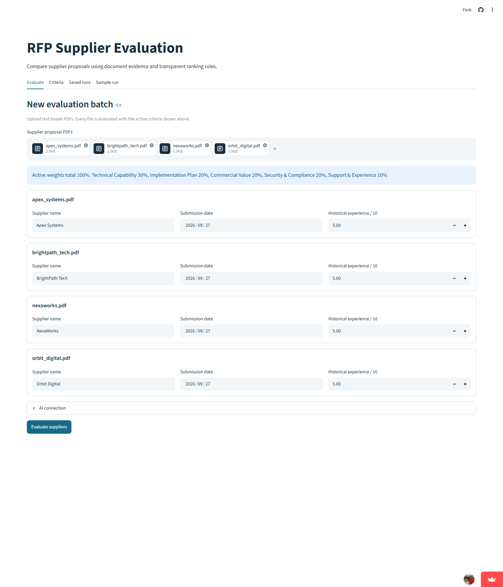
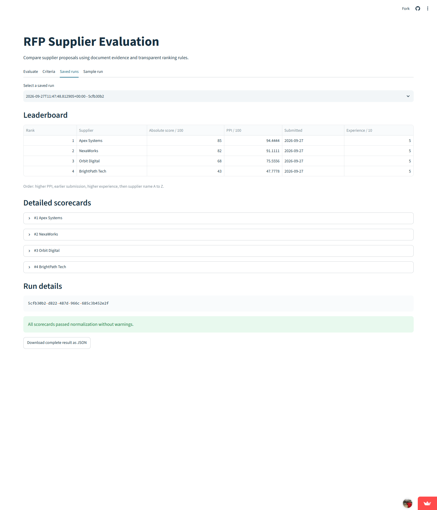
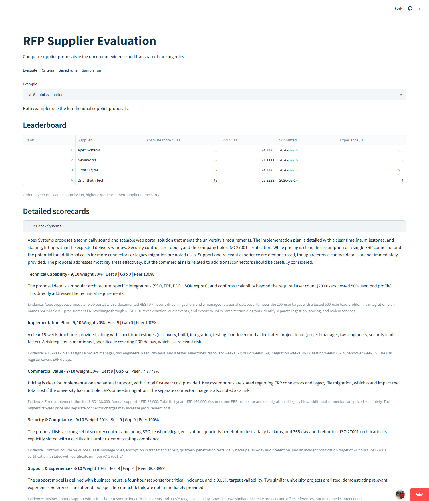
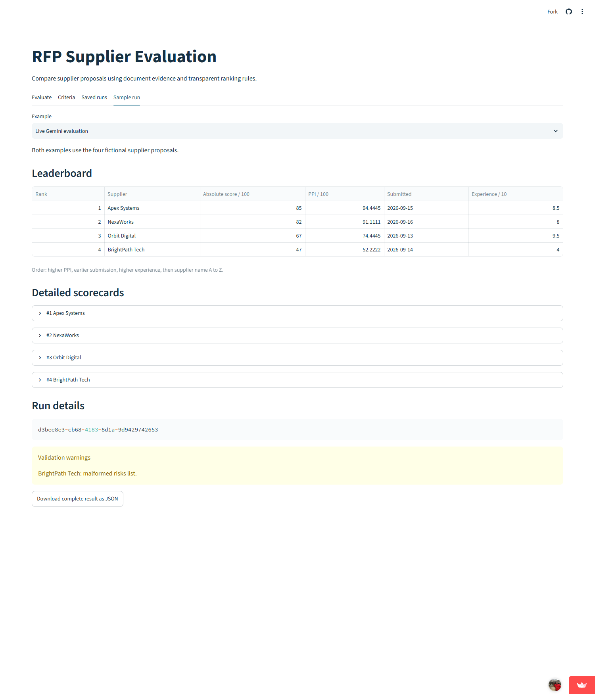
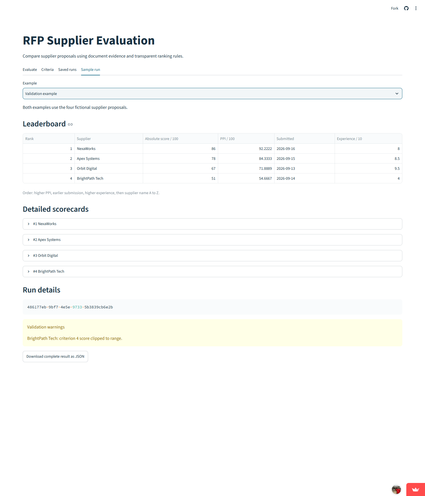
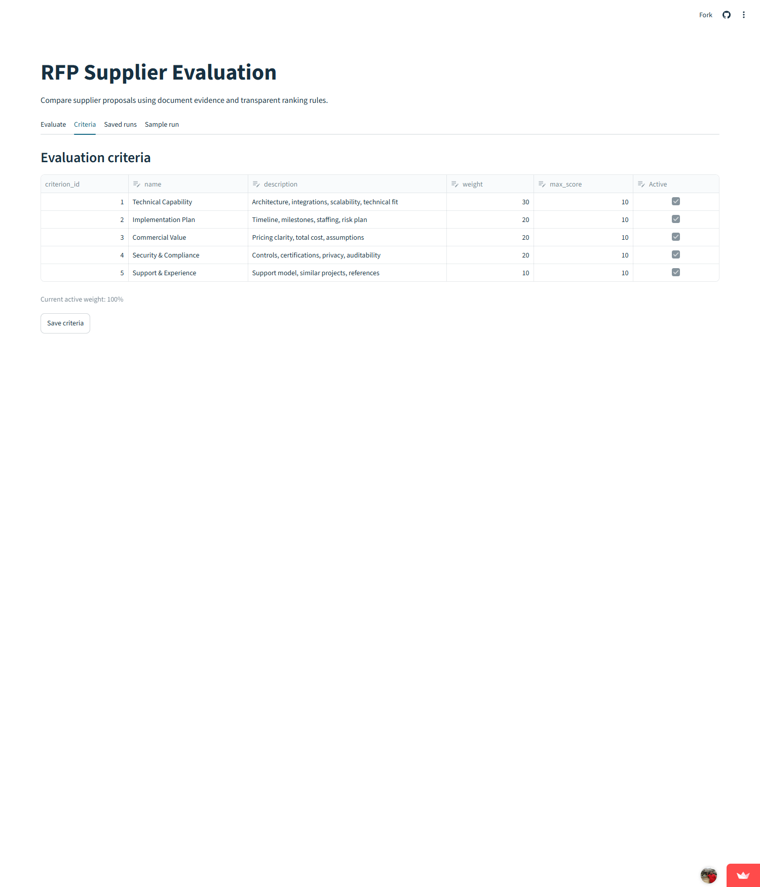

# Demonstration

Public application: https://rfp-evaluation-kvlnarasimharao.streamlit.app/

## Successful completed run

1. Upload the four PDFs from [data/proposals](../data/proposals) and enter supplier names, dates, and experience ratings.
2. Select Evaluate suppliers. The public app completes a four-supplier batch and saves it under one run ID.
3. Open Saved runs to review the leaderboard. Apex Systems ranked first in the hosted test, with an absolute score of 85 and PPI of 94.4444.
4. Expand a supplier to inspect scores, explanations, evidence, benchmarks, gaps, relative percentages, and weights.
5. Select Download complete result as JSON. The exported file from this hosted test is [data/hosted_run.json](../data/hosted_run.json).

The Sample run tab also presents an earlier completed Gemini evaluation in [data/live_run.json](../data/live_run.json).

## Validation example

1. In Sample run, choose Validation example.
2. The example contains a Security and Compliance score below zero for BrightPath Tech. Validation clips it to zero before scoring.
3. The corrected score is used in the weighted total and peer comparison. The validation example ranks NexaWorks first. Its complete result is in [data/sample_run.json](../data/sample_run.json).

## Criteria

The Criteria tab shows the active SQLite rubric and weights. The five active weights total 100%.

## Verification

The public application accepted the four PDFs, completed the hosted batch, displayed the saved leaderboard and scorecards, and exported the JSON file. Streamlit's application test harness loaded all four tabs without exceptions. All four automated tests pass with the test command in README.md.
